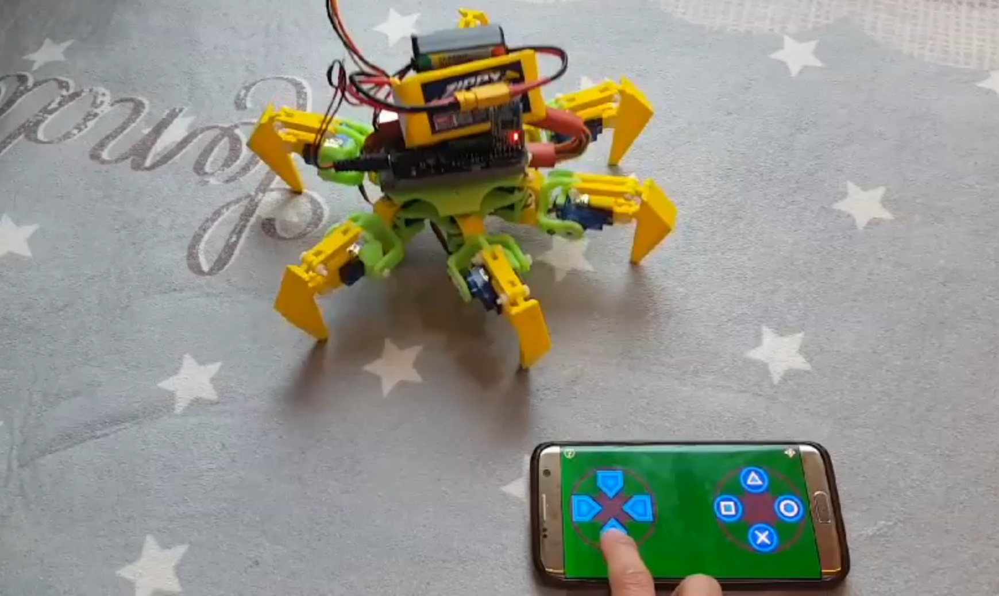

## What is that

this is my class project haxabot.
need sg90 12 ea and arduino uno(standard) and make shield.  

교양 수업 때 미니 프로젝트로 제작하였습니다. 3차원 인쇄와 SG90을 사용하였으며 아두이노 우노 기반 쉴드를 제작하여 프로그래밍을 진행하였습니다.  

## Model

## Movie

저의 프로젝트 구동 [영상](https://youtu.be/sZA9VcK2ML0) 입니다.  

## 3D print

내가 참고한 [부품](https://www.thingiverse.com/thing:1021540)입니다.  